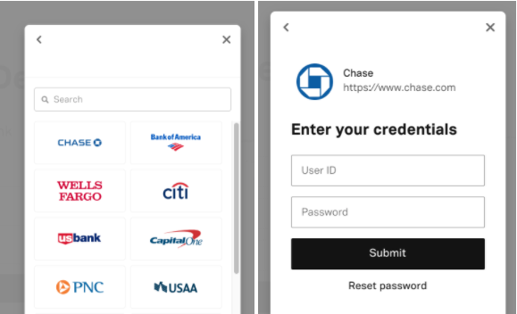
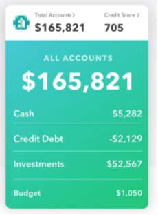
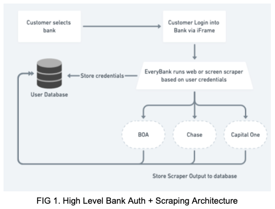

# EveryBank Monitoring Case

## Background
Suppose you work at the hypothetical company EveryBank. EveryBank offers a unified banking API for app developers. The API helps developers build products that require consumers to link together multiple bank accounts. For example, the EveryBank API can help developers build a "check your net worth across all your bank accounts" feature.

A consumer can link an account via an embedded iframe inside the developer's app:

In order for EveryBank to offer a unified banking API, they web scrape (or screen scrape) thousands of banking websites in real-time. They do not use official bank APIs. Each bank website is thus a unique third-party dependency.

## Exercise Questions
For each of these questions, please try to be as specific as you can. Use whatever format or style best conveys your thoughts and ideas - you don't need to write narrative paragraphs.

1) __If you worked at EveryBank would you build a holistic monitoring system in order to quickly identify new emergent issues?__

### __Problem__
EveryBank’s API provides the abilities for developers to fetch a customer’s bank data via real-time web or screen scraping. Since each bank presents a customer’s account data in a unique way, EveryBank must develop and maintain unique scrapers to conform to the available data. Because scrapers are tightly coupled with the structure, layout, or identifiers of the source being scraped, it is critical to identify errors and establish processes that aid in quick/informed remediation.

### __Customer + Pain Points__
As a technical product manager, it is my job to own and drive initiatives that design for our customer’s problems. These are some of my assumptions regarding customer requirements:

- __Data Accuracy__: Customers using the EveryBank API expect up-to-date information that is a direct reflection of the most current available data when requested
- __Data Availability__: Customers using the EveryBank API expect to be returned usable data (successful response) with high uptime given the reliance of the data in core business function
- __Latency__: Customers expect to data to be returned quickly without delay

### __Solution: Holistic Monitoring Solution__
In order to ensure the maintenance of a high quality product and user experience, implementing a monitoring solution is critical to success.

- Types of breakages that should be monitored:
    - __Changing Data Source__: Every website will change its structure at any time meaning scrapers will need adjustments every few months or even weeks. Minor changes in target websites affecting the data fields that are scraped might result in incomplete data or the scraper failing.
        - Implementation Detail: We will require a mechanism to receive alerts when data scraped is invalid, incorrect, or null, from a particular scraper to pinpoint failures. Failures can be remediated manually or via advanced automations that self correct and re-try to prevent further service disruptions.
    - __Data Source Downtime__: Websites are primarily designed with human visitors in mind and a typical user may browse through only a handful of pages every minute. Web crawlers, on the other hand, are capable of visiting thousands or even millions of web pages every second; so, if not careful, a web crawler can easily exhaust a website's resources within a very short period of time with devastating consequences. This problem is also magnified by the fact that a typical website is usually being crawled by multiple bots at the same time.
        - Implementation Detail: We require every web crawler to rate-limit its requests, to make sure that there is always an appropriate delay between consecutive visits to a website. In a multi-threaded environment like ours, we should be extra careful to prevent race conditions when it comes to tracking requests and rate limiting parameters.
    - __Anti-Scraping Tools__: Large scale scraping comes with a multitude of problems and anti-scraping tools and techniques are one of the biggest. There is a considerable number of bot mitigation & screen scraping protection tools like Akamai, Distill Networks, Shield Square, or Perimeter X that block your scrapers from accessing websites usually by an IP Ban. If any of the websites you need have any IP based blocking involved, your servers’ IP address will be blacklisted in no time. The site will not respond to requests from your servers or show you a captcha, leaving you with very few options after getting blacklisted.
        - Implementation Detail: We might consider rotating the requests made through varied private proxies if not dealing with a captcha or anti-scraping service. We also might consider making requests through a provider with 100,000+ geo proxies that are not completely blacklisted when dealing with most anti-scraping technologies. Regardless it would be important to build a mechanism to log these blocked IPs and check against this list when refreshing this.

Types of data streams could used for monitoring system:
 - __Data Queue__: Given the potential for millions of scraping operations that EveryBank might process, we will require several servers and a method to distribute scrapers across them and have them communicate with one another. Using a message broker like Redis, RabbitMQ, or Kafka to process the extracted scraper output data, we can write quality assurance tests to analyze valid output that tie into our alerting/logging stack before or during writes to our database. This would be useful when analyzing metrics for individual scrapers
- __Application Logs__: Depending on the architecture of the system, we might consider application logs that indicate overall health of EveryBank API service. We can track HTTP codes for example to track successful responses, partial responses, or failed requests.

Key Performance Indicators:
- Scrapers:
    - Average Scraper Success Rate
    - Average Scraper Response Time
    - Number of Requests Received Per Scraper

- EveryBank Endpoint:
    - API Success Rate
    - API Response Time
    - Number of Requests Received Per Min/Hour/Day
    
Tooling + Infrastructure:
- Tools/Platforms to Use:
    - Scrapers: Scrapy (Python), PySpider (Python), or Puppeteer (JS)
    - Testing: Pandas, Cerebrus, Schema
    - Scheduling: Scrapyd + CRON or AWS CloudWatch
    - Scrapers/Service Analytics: AWS X-Ray
    - Alerting: Splunk, PagerDuty
    - All In One Solution: Datadog

- Tools/Platforms to Build:
    - Rotating Proxy Server
    - ELK stack for application logs
